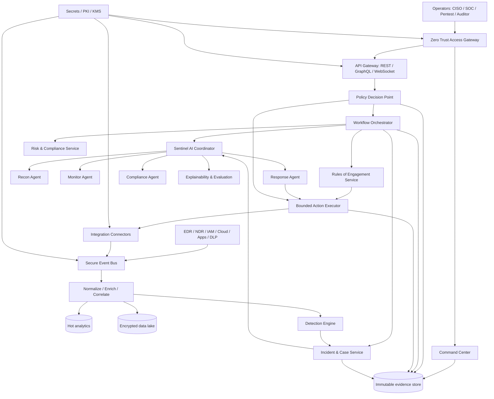

# Sentinel AI Security Ecosystem — System Design Document

Status: Reference architecture and phased implementation blueprint  
Owner: ScottsTechX Enterprise (U) Ltd  
Version: 0.1  
Last updated: 2026-07-23

> This document defines a target state. It does not claim that the described services, integrations, performance levels, certifications, or autonomous capabilities are deployed today. Every production phase requires a signed scope, threat model, architecture review, privacy review, security test, recovery test, and formal go-live approval.

## 1. Purpose

Sentinel AI is a governed security operations ecosystem intended to unite:

- defensive telemetry, detection, investigation, and response;
- strictly authorized security assurance and adversary simulation;
- AI-assisted enrichment, decision support, and bounded orchestration;
- asset, risk, compliance, evidence, and executive oversight;
- a role-aware command center and integration APIs.

The design follows Zero Trust, defense in depth, least privilege, secure-by-default operation, immutable evidence, and human accountability.

## 2. Assumptions and non-goals

### Assumptions

- The organization owns or has explicit written authorization to test every in-scope asset.
- Identity, asset ownership, data classification, and retention requirements can be established before automation.
- Existing security tools are integrated through supported APIs or collectors rather than replaced all at once.
- Deployment starts in a laboratory and non-production environment.

### Non-goals

- Unsupervised exploitation, persistence, credential theft, or testing beyond a signed Rules of Engagement (RoE).
- A universal claim of millions of events per second, a false-positive rate below 0.001%, or sub-100 ms interaction latency without a measured workload and capacity test.
- Fully autonomous disruptive response. Isolation, account disablement, traffic blocking, evidence deletion, and active testing require explicit policy and accountable approval unless a narrow, reversible playbook has been pre-authorized.
- Storage of plaintext secrets, real credentials collected during testing, or unrestricted model access to sensitive evidence.

## 3. Architecture principles

1. **Policy enforcement is separate from orchestration.** An agent cannot approve its own action.
2. **Fail closed.** Missing identity, scope, approval, telemetry, or evidence controls block execution.
3. **Every action is attributable.** Record actor, intent, policy decision, model/tool version, target, request, result, and evidence hash.
4. **Blast radius is bounded.** Concurrency limits, canaries, maintenance windows, kill switches, and rollback are mandatory.
5. **Assistance precedes autonomy.** Start read-only, then recommendations, then simulations, then reversible automation.
6. **Claims are evidence-based.** Performance and security targets become SLOs only after benchmark validation.
7. **Data minimization.** Collect only what is required, encrypt it, and retain it according to classification and legal purpose.

## 4. Logical architecture



## 5. Trust boundaries

| Boundary | Controls |
|---|---|
| User device → access edge | FIDO2/WebAuthn, phishing-resistant MFA, device posture, conditional access, short sessions |
| Access edge → application | OAuth 2.1/OIDC, audience-bound tokens, mTLS for services, WAF, rate limits |
| Application → orchestration | Policy-as-code, workload identity, signed commands, authorization context |
| Orchestration → action executor | Separate approval authority, RoE token verification, allow-listed actions, timeouts, kill switch |
| Collectors → event bus | Mutual TLS, schema validation, tenant/zone isolation, backpressure, replay protection |
| Services → data | Per-service identity, encryption, row/tenant controls, audited queries, retention policies |
| Model runtime → tools/data | Retrieved-source allow-list, prompt-injection filtering, scoped tool handles, output validation |
| Production → assurance zone | Segmented runners, egress policy, disposable workers, no unrestricted lateral access |

## 6. Core services

### 6.1 Identity and policy

- External identity provider through OIDC.
- FIDO2/WebAuthn required for privileged roles.
- RBAC for job functions; ABAC for asset criticality, tenant, geography, environment, and incident severity.
- Just-in-Time privileged access with reason, ticket, duration, and approval.
- Policy Decision Point (PDP) and Policy Enforcement Points (PEPs) at API, workflow, and executor boundaries.

### 6.2 Rules of Engagement service

An RoE record contains:

- engagement ID, owner, customer, legal authorization reference;
- exact IP ranges, domains, cloud accounts, APIs, wireless zones, and excluded targets;
- allowed and denied techniques;
- start/end times and maintenance windows;
- concurrency, request-rate, and data-volume limits;
- escalation contacts, emergency stop authority, and rollback procedure;
- required approvers and detached digital signatures.

The executor validates a short-lived, audience-bound engagement token immediately before every active action. DNS changes, target drift, expired authorization, missing approvals, or policy conflicts stop execution.

### 6.3 Defensive pipeline

- Collectors ingest endpoint, identity, cloud, network, application, database, and data-protection events.
- Schema registry versions normalized event contracts.
- Enrichment adds asset owner, criticality, identity, threat intelligence, vulnerabilities, and change context.
- Detection-as-code rules and approved models produce alerts with provenance and confidence.
- Cases preserve timeline, evidence, analyst actions, approvals, and containment outcomes.

### 6.4 AI coordinator

The AI coordinator is a decision-support layer, not an authority source.

- RAG retrieves only approved policies, runbooks, asset records, and prior sanitized incidents.
- Every answer cites evidence IDs and freshness.
- Tool calls use structured schemas, deterministic validation, and scoped service identities.
- High-impact requests require the PDP and a human approval record.
- Model evaluation covers hallucination, prompt injection, unsafe tool selection, data leakage, bias, drift, and graceful degradation.
- Model output is never treated as proof of compromise without corroborating telemetry.

### 6.5 Command center

Role-specific surfaces:

- **CISO:** risk, control effectiveness, material incidents, investment scenarios.
- **SOC analyst:** alert queue, incident timeline, enrichment, evidence, playbook preview.
- **Pentester:** approved engagements, target scope, execution status, findings, stop control.
- **Auditor:** control mapping, immutable evidence, attestations, report export.
- **Executive:** concise verified summaries without sensitive tactical details.

WCAG 2.1 AA, keyboard operation, strong focus states, reduced-motion support, and responsive layouts are release requirements.

## 7. Data architecture

### 7.1 Storage classes

| Store | Purpose | Suggested technology |
|---|---|---|
| Transactional | Users, assets, cases, engagements, approvals, controls | PostgreSQL |
| Event streaming | Telemetry and workflow events | Kafka or Pulsar |
| Hot analytics | Fast event and detection queries | ClickHouse or OpenSearch |
| Object evidence | Reports, packet/evidence artifacts, exports | S3-compatible object storage with Object Lock |
| Graph | Assets, identities, privileges, attack paths | PostgreSQL + graph extension initially; dedicated graph DB only when justified |
| Vector retrieval | Approved policy/runbook chunks | pgvector initially |
| Secrets and keys | Dynamic credentials, PKI, encryption keys | Vault plus cloud KMS/HSM |

### 7.2 Core relational schema

```sql
CREATE TABLE tenants (
  id uuid PRIMARY KEY,
  name text NOT NULL,
  created_at timestamptz NOT NULL DEFAULT now()
);

CREATE TABLE assets (
  id uuid PRIMARY KEY,
  tenant_id uuid NOT NULL REFERENCES tenants(id),
  kind text NOT NULL,
  canonical_name text NOT NULL,
  environment text NOT NULL,
  criticality smallint NOT NULL CHECK (criticality BETWEEN 1 AND 5),
  owner_id uuid,
  classification text NOT NULL,
  attributes jsonb NOT NULL DEFAULT '{}',
  first_seen_at timestamptz NOT NULL,
  last_seen_at timestamptz NOT NULL,
  UNIQUE (tenant_id, kind, canonical_name)
);

CREATE TABLE engagements (
  id uuid PRIMARY KEY,
  tenant_id uuid NOT NULL REFERENCES tenants(id),
  name text NOT NULL,
  status text NOT NULL,
  starts_at timestamptz NOT NULL,
  ends_at timestamptz NOT NULL,
  scope jsonb NOT NULL,
  constraints jsonb NOT NULL,
  authorization_document_hash text NOT NULL,
  created_by uuid NOT NULL,
  CHECK (ends_at > starts_at)
);

CREATE TABLE approvals (
  id uuid PRIMARY KEY,
  tenant_id uuid NOT NULL REFERENCES tenants(id),
  subject_type text NOT NULL,
  subject_id uuid NOT NULL,
  decision text NOT NULL,
  decided_by uuid NOT NULL,
  reason text NOT NULL,
  expires_at timestamptz,
  signature text NOT NULL,
  created_at timestamptz NOT NULL DEFAULT now()
);

CREATE TABLE incidents (
  id uuid PRIMARY KEY,
  tenant_id uuid NOT NULL REFERENCES tenants(id),
  title text NOT NULL,
  severity text NOT NULL,
  status text NOT NULL,
  confidence numeric(5,4),
  owner_id uuid,
  opened_at timestamptz NOT NULL,
  closed_at timestamptz
);

CREATE TABLE findings (
  id uuid PRIMARY KEY,
  tenant_id uuid NOT NULL REFERENCES tenants(id),
  engagement_id uuid REFERENCES engagements(id),
  asset_id uuid REFERENCES assets(id),
  title text NOT NULL,
  status text NOT NULL,
  severity text NOT NULL,
  cvss_vector text,
  evidence_refs jsonb NOT NULL DEFAULT '[]',
  remediation text NOT NULL,
  created_at timestamptz NOT NULL DEFAULT now()
);

CREATE TABLE action_requests (
  id uuid PRIMARY KEY,
  tenant_id uuid NOT NULL REFERENCES tenants(id),
  action_type text NOT NULL,
  target_ref text NOT NULL,
  requested_by uuid NOT NULL,
  policy_decision text NOT NULL,
  approval_id uuid REFERENCES approvals(id),
  dry_run_result jsonb,
  status text NOT NULL,
  idempotency_key text NOT NULL UNIQUE,
  created_at timestamptz NOT NULL DEFAULT now()
);

CREATE TABLE audit_events (
  id uuid PRIMARY KEY,
  tenant_id uuid NOT NULL REFERENCES tenants(id),
  occurred_at timestamptz NOT NULL,
  actor_ref text NOT NULL,
  action text NOT NULL,
  resource_ref text NOT NULL,
  decision jsonb NOT NULL,
  evidence_hash text NOT NULL,
  previous_hash text,
  signature text NOT NULL
);
```

Tenant isolation must be enforced at the database and service layers. Audit-event update/delete permissions are denied to application roles.

## 8. API design

### 8.1 REST resources

- `POST /v1/engagements` — create draft engagement.
- `POST /v1/engagements/{id}/authorize` — attach approvals and signed authorization.
- `POST /v1/engagements/{id}/actions:validate` — dry-run RoE and policy evaluation.
- `POST /v1/incidents` and `GET /v1/incidents/{id}` — case lifecycle.
- `POST /v1/incidents/{id}/actions` — request bounded response action.
- `POST /v1/actions/{id}/approve` — separate approver decision.
- `POST /v1/actions/{id}/execute` — idempotent, policy-rechecked execution.
- `GET /v1/assets` and `GET /v1/assets/{id}/risk` — asset and risk views.
- `GET /v1/controls/{framework}` — compliance control mapping.
- `GET /v1/audit/events` — privileged, filtered, paginated evidence access.

All mutating endpoints require an idempotency key, correlation ID, strong actor identity, and policy context. OpenAPI 3.1 is generated from source and validated in CI.

### 8.2 Action request example

```json
{
  "action_type": "isolate_endpoint",
  "target": {"asset_id": "4c6f..."},
  "reason": "Confirmed ransomware behavior with two independent detections",
  "incident_id": "be1a...",
  "mode": "dry_run",
  "requested_duration_seconds": 900
}
```

The API returns the matched policy, required approvals, expected impact, rollback plan, and expiry. It never silently escalates from dry-run to execution.

## 9. Deployment reference

### 9.1 Environments

- `dev`: synthetic data only.
- `integration`: emulated connectors and replayed sanitized events.
- `security-lab`: isolated adversary simulation range.
- `staging`: production-equivalent configuration with non-production targets.
- `production`: approved integrations and enforced data residency/retention.

### 9.2 Kubernetes posture

- Private clusters, restricted control-plane access, workload identity, and default-deny network policies.
- Signed images and admission verification; no `latest` tags.
- Read-only root filesystems, non-root users, dropped Linux capabilities, seccomp, resource limits.
- Separate namespaces and node pools for ingestion, analytics, AI runtime, and bounded executors.
- Egress allow-lists for connectors and model endpoints.
- External secrets delivered dynamically; no Kubernetes Secret manifests containing plaintext values.
- Pod disruption budgets, anti-affinity, multi-zone placement, and tested restore procedures.

### 9.3 Infrastructure as Code module layout

```text
infra/
  modules/
    network/
    kubernetes/
    pki-kms/
    event-bus/
    databases/
    object-lock-evidence/
    observability/
  environments/
    dev/
    integration/
    staging/
    production/
```

IaC must include policy checks, cost estimation, drift detection, dependency scanning, and a reviewed plan before apply.

## 10. Security controls

- TLS 1.3 where supported; TLS 1.2 only for documented integration exceptions.
- AES-256-GCM or provider-managed equivalent at rest with per-environment keys.
- Secrets from Vault/KMS with rotation and short TTLs.
- CSP, HSTS, `frame-ancestors`, MIME sniffing protection, strict referrer policy, and permissions policy at the web edge.
- Parameterized queries, schema validation, output encoding, request size limits, and rate limiting.
- SBOM generation, dependency pinning, SAST, secret scanning, IaC scanning, image scanning, signing, and provenance attestations.
- Central audit with immutable retention and monitored break-glass access.
- Quarterly threat-model review and independent penetration tests before major releases.

## 11. ML and AI specifications

### Model families

- Rules and statistical baselines for deterministic high-signal detections.
- Isolation Forest/robust statistical methods for bounded anomaly use cases.
- Graph analytics for identity and asset relationships.
- Sequence models only where labeled data, drift monitoring, and explainability justify them.
- LLMs for summarization, retrieval, structured extraction, and runbook assistance—not sole-source blocking decisions.

### Required evaluation

- Precision, recall, F1, PR-AUC by detection family and asset class.
- False-positive workload per analyst-hour, not only a global rate.
- Detection latency and event-loss behavior under backpressure.
- Prompt-injection success rate, citation accuracy, unsupported-claim rate, sensitive-data leakage, unsafe tool-selection rate.
- Drift, data quality, fairness, calibration, and abstention behavior.
- Shadow mode and canary promotion before any automated action.

## 12. Runbook controls

Every runbook contains trigger, evidence requirements, scope, preconditions, authority, steps, communication, rollback, validation, and post-incident actions.

### Ransomware

1. Confirm with at least two independent signals.
2. Open a severity-based incident and preserve volatile evidence.
3. Preview endpoint isolation impact and identify critical dependencies.
4. Obtain required approval or invoke a pre-authorized reversible playbook.
5. Isolate affected endpoints, revoke sessions, and block confirmed indicators.
6. Validate containment, preserve images/logs, and begin eradication.
7. Restore only from verified clean backups; monitor for recurrence.

### Compromised identity

1. Validate impossible travel/password spray/token misuse with identity and endpoint context.
2. Revoke active sessions and rotate credentials under policy.
3. Preserve sign-in, MFA, mailbox, cloud, and admin audit evidence.
4. Review privilege changes, OAuth grants, forwarding rules, and lateral access.
5. Restore access using phishing-resistant MFA and verified device posture.

### Cloud credential exposure

1. Disable or constrain the credential using the least disruptive safe action.
2. Identify usage, permissions, affected resources, and data access.
3. Rotate dependent secrets and invalidate sessions.
4. Search logs for unauthorized changes and persistence.
5. Correct the root cause and validate with policy-as-code.

## 13. Testing strategy

### Unit

- Policy decisions, scope matching, token expiry, target normalization, idempotency, state transitions, serialization.

### Integration

- OIDC, SIEM/EDR/cloud connectors, event schema compatibility, database isolation, evidence signing, secret rotation.

### Security

- OWASP ASVS Level 3 verification for the command center and APIs.
- Authorization bypass, tenant isolation, SSRF, injection, insecure deserialization, request smuggling, rate-limit abuse, WebSocket authorization.
- AI prompt injection, indirect prompt injection, tool abuse, data exfiltration, unsafe recommendation, and model denial-of-service.

### Resilience and chaos

- Broker loss, consumer lag, database failover, KMS/Vault outage, expired certificates, connector throttling, model outage, region failure.
- Confirm graceful degradation: core case handling and manual runbooks remain available without AI.
- Recovery tests measure actual RPO/RTO; targets are not declared met until demonstrated repeatedly.

### Performance

Use representative event distributions, tenant counts, retention windows, query patterns, and connector failure rates. Publish tested envelopes and scaling thresholds. Do not extrapolate a single synthetic benchmark into a universal throughput claim.

## 14. Delivery roadmap and gates

| Phase | Outcome | Mandatory exit gates |
|---|---|---|
| 1. Foundation | Identity, asset inventory, event contracts, audit, command-center shell | Threat model approved; restore test passes; privileged access reviewed |
| 2. Defense | SIEM ingestion, detection-as-code, incidents, CSPM/ITDR | Coverage and latency measured; analyst workflow accepted; no critical test findings |
| 3. Assurance | RoE service, safe validation, attack paths, remediation | Legal approval; lab and non-production tests; kill switch and rollback demonstrated |
| 4. AI assistance | RAG, investigation copilot, recommendation and simulation | Evaluation thresholds met; citation and leakage tests pass; manual fallback verified |
| 5. Bounded automation | Pre-approved reversible response playbooks | Canary period; false-action rate accepted; approval/audit/recovery tests pass |
| 6. Resilience | Multi-region recovery, chaos program, continuous evidence | Repeated RPO/RTO proof; independent security review; operating model funded |

## 15. Success measures

Treat the original values as aspirational targets subject to measurement:

- critical detection coverage mapped to threat model and ATT&CK techniques;
- precision/recall per detection family and asset class;
- median and percentile MTTD/MTTR by incident severity;
- percentage of critical assets with an accountable owner and current telemetry;
- percentage of high-impact actions with valid approval and complete evidence;
- recovery success rate and demonstrated RPO/RTO;
- remediation SLA adherence and recurrence rate;
- analyst hours saved without increased missed incidents or unsafe actions;
- audit findings and control-evidence freshness.

## 16. Production-readiness checklist

- [ ] Signed business owner, data owner, legal, privacy, and security approvals.
- [ ] Threat model and abuse cases current.
- [ ] Identity, authorization, tenant isolation, and break-glass tested.
- [ ] RoE fail-closed behavior and kill switch demonstrated.
- [ ] No plaintext secrets; rotation and revocation tested.
- [ ] Backups restored; evidence immutability verified.
- [ ] SAST, DAST, dependency, IaC, image, and secret scans pass policy.
- [ ] Penetration test has no unresolved critical/high findings.
- [ ] Model evaluation and manual fallback pass acceptance criteria.
- [ ] Observability, on-call, incident response, capacity, and cost controls operational.
- [ ] Architecture decision records and operator documentation approved.

This SDD is the starting point for discovery and controlled implementation, not a substitute for environment-specific design, legal authorization, or security validation.
